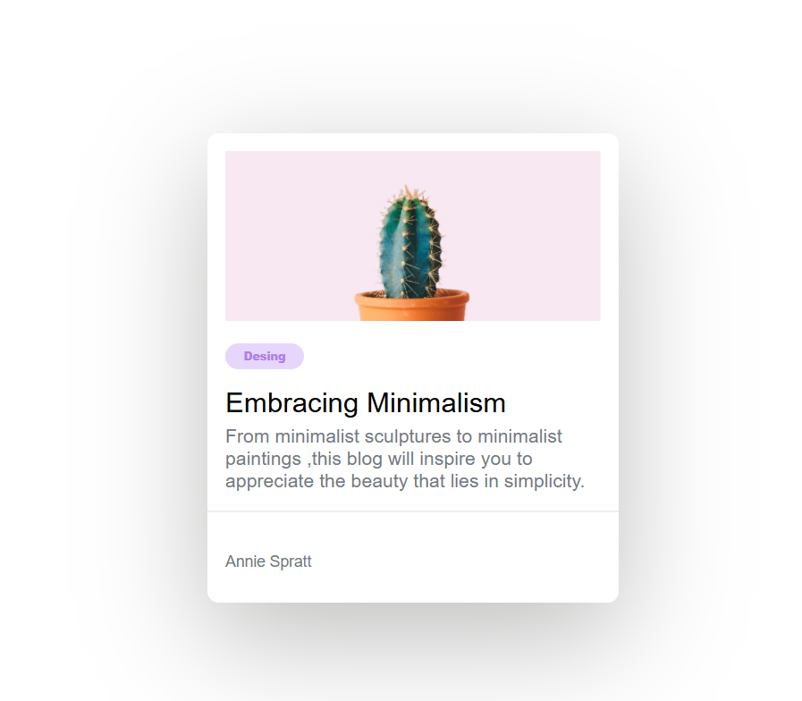

# Minimal Blog Card

Este desafío es una excelente manera de comenzar con habilidades básicas de HTML y CSS. El reto consiste en crear una tarjeta de blog sencilla que incluya:

- Una imagen
- Un título
- Una breve descripción
- Una etiqueta

## Descripción del Proyecto

Este es un ejercicio que realicé para practicar HTML y CSS, utilizando flexbox, colores y otros elementos de diseño. 

## Características

- Diseño responsivo con flexbox
- Estilización básica con CSS
- Componentes de interfaz de usuario sencillos y efectivos

## Imagen del Ejercicio

## Enlace a la Demo

Puedes ver la tarjeta de blog en vivo en el siguiente enlace:

[Ver la tarjeta de blog](https://greg0910.github.io/Minimal-Blog-Card-/)
